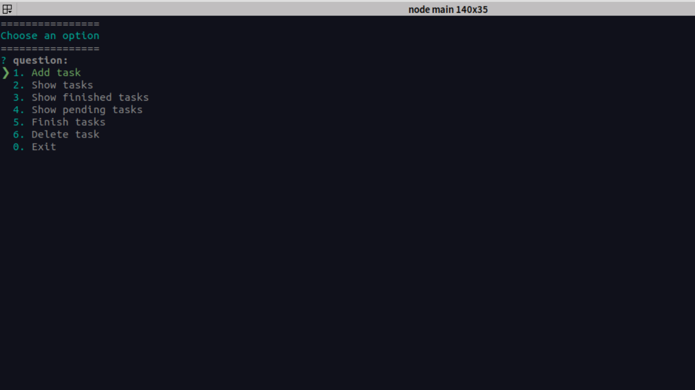

#  CLI TODO APP

## What is CLI TODO APP?

It's a cli app wrote in NODEJS, to create, delete, mark a complete tasks.

## Getting Started
1. Install [Node.js](http://nodejs.org/)
2. Run `npm install ` (this install all the dependencies required to run the app).
3. Run the application with `node main`.

## Built With ❤

* [NodeJS](https://nodejs.org/en/) 
* [Inquirer](https://github.com/SBoudrias/Inquirer.js) 
* [Colors](https://github.com/Marak/colors.js) 
* [uuid](https://github.com/uuidjs/uuid)

## Authors

* **Analin Flores** - - [Any28Flo](https://github.com/Any28Flo)
